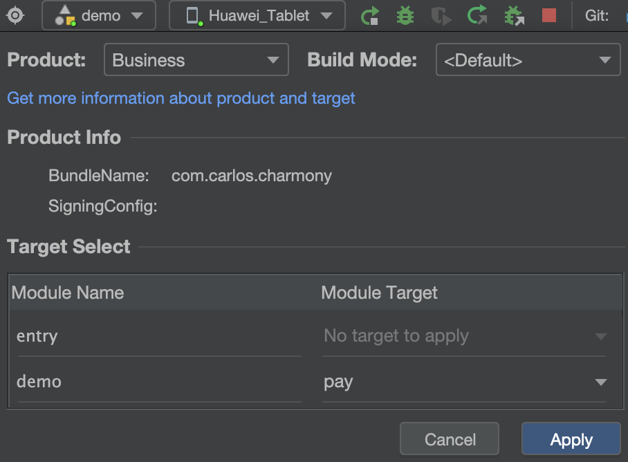

Harmony多目标产物方案

## 前言
[Android多渠道打包简单介绍](https://xbdcc.github.io/2017/07/27/Android多渠道打包简单介绍)

## 概述
多目标产物在HarmonyOS系统中的应用主要体现在软件开发与分发方面，特别是针对不同用户群体、不同业务场景的需求进行定制化开发。多目标产物为开发者提供了更加灵活和高效的开发方式，使得应用能够更好地适应市场需求和变化。通过定制化开发，还可以更好地满足用户的个性化需求，提升用户体验。

## 基本概念
target：对应HAR、HSP、HAP的多目标产物。工程内的每一个模块可以定义多个target，每个Target对应一个定制的HAP、HAR包，通过配置可以实现一个模块构建出不同的HAP、HAR包。
product：对应App的多目标产物。一个HarmonyOS工程的构建产物为App包，一个工程可以定义多个product，每个product对应一个定制化应用包，通过配置可以实现一个工程构建出多个不同的应用包。

## 应用场景
主要应用场景:

不同用户群体：针对不同的用户群体（如国内用户与国际用户等），HarmonyOS系统支持构建不同的应用版本。这些版本在功能、界面、语言等方面可能有所不同，以满足不同用户群体的需求。
不同业务场景：在不同的业务场景中，同一个应用可能需要提供不同的功能或资源。例如，一个在线教育应用可能需要为学生提供学习资料，而为教师提供教学资料。HarmonyOS系统支持通过配置不同的Target来实现这种差异化定制。

1. Community社区版本，免费，向个人开发者用户提供该应用绝大部分基础功能，但是不提供部分定制化限定功能及技术支持。
2. Ultimate终极版本，收费，向个人、政企等开发者用户提供该应用全部基础功能，同时提供定制化限定功能及技术支持。

## 构建原理图


## 使用

### 多产物
如在我们的工程下的`build-profile.json5`下添加两个product
```
      {
        "name": "Community",
        "compatibleSdkVersion": "5.0.0(12)"
      },
      {
        "name": "Business",
        "compatibleSdkVersion": "5.0.0(12)",
      }
```
`Community`代表社区版、`Business`代表商业版。可以看到Product下多了`Community`和`Business`两个，当切到`Community`时`Module Target`提示`No target to apply`是什么原因呢？后面会介绍。


那么假如现在有个需求，当前社区版我们想跑在`HarmonyOS`的机器上，但是商用还是`OpenHarmony`上，需要出不同的包怎么实现呢？
如果当我们没有了解多产物目标方案时，最传统的可能就是注释`default`下的环境替换了，或者通过`hvigorfile`脚本编译替换，
而当了解了多产物则比较好实现，我们在不同的product中可以配置不同的编译环境，如`Business`改为:
```
      {
        "name": "Business",
        "runtimeOS": "OpenHarmony",
        "compileSdkVersion": 11,
        "compatibleSdkVersion": 11
      }
```

### 多目标
接下来我们在模块下的`build-profile.json5`中定义两个target，如:
```
    {
      "name": "free",
    },
    {
      "name": "pay"
    }
```
把target指定给product，工程下的`build-profile.json5`中当前module节点下的`targets`增加如下：
```
        {
          "name": "free",
          "applyToProducts": [
            "default",
            "Community"
          ]
        },
        {
          "name": "pay",
          "applyToProducts": [
            "default",
            "Business"
          ]
        }
```
此时再点击`DevEco Studio`中的`Product`，可以看到有target了：



### 更多实践
#### 自定义代码资源目录及自定义参数
```
    {
      "name": "free",
      "runtimeOS": "HarmonyOS",
      "config": {
        "buildOption": {
          "arkOptions": {
            "buildProfileFields": {
              "buildData": "free"
            }
          }
        }
      },
      "source": {
        "sourceRoots": [
          "./src/free"
        ]
      },
      "resource": {
        "directories": [
          "./src/main/resources",
          "./src/main/resource_free"
        ]
      },
      "output": {
        "artifactName": "free"
      }
    },
    {
      "name": "pay",
      "runtimeOS": "OpenHarmony",
      "config": {
        "buildOption": {
          "arkOptions": {
            "buildProfileFields": {
              "buildData": "pay"
            }
          }
        }
      },
      "source": {
        "sourceRoots": [
          "./src/pay"
        ]
      },
      "resource": {
        "directories": [
          "./src/main/resources",
          "./src/main/resource_pay"
        ]
      },
      "output": {
        "artifactName": "pay"
      }
    }
```
在`main`同级目录中创建`free`和`pay`两个文件夹，在`main`中`ets`下创建`component`文件夹，其中再创建`DemoComponent`组件，
在`resource`同级目录创建`reource_free`和`resource_pay`两个资源目录，分别放入不同图片命名为`product_target_screen`,
`DemoComponent`组件代码示例如下：
```
@Component
export struct DemoComponent {
  build() {
    Text('The custom build data is:' + BuildProfile.buildData)
      .backgroundImage($r('app.media.product_target_screen'))
      .width('100%')
      .height('100%')
  }
}
```
然后再在默认的`Index.ets`中添加该组件，引用包如下：
```
import { DemoComponent } from 'demo/ets/component/DemoComponent';
```
此时切换不同的`target`查看`Previewer`，可以看到文本和图片显示不一样了：


### `hvigorfile`脚本实践
#### 通过脚本移除三方库依赖
假如我们想社区版带开源库，商业版不集成三方库，这时我们可以通过`hvigor`脚本在编译时移除商业版的依赖。
如模块下的`hvigorfile.ts`文件：
```typescript
import { hapTasks, OhosHapContext, OhosPluginId } from '@ohos/hvigor-ohos-plugin';
import { getNode } from '@ohos/hvigor'

const entryNode = getNode(__filename);
// 为此节点添加一个afterNodeEvaluate hook 在hook中修改module.json5的内容并使能
entryNode.afterNodeEvaluate(node => {
  // 获取此节点使用插件的上下文对象 此时为hap插件 获取hap插件上下文对象
  const hapContext = node.getContext(OhosPluginId.OHOS_HAP_PLUGIN) as OhosHapContext;
  hapContext.targets((target: Target)=> {
    console.log(target.getCurrentProduct().getProductName())
    if (target.getCurrentProduct().getProductName() == 'Business') {
      const depOpt = hapContext.getDependenciesOpt()
      delete depOpt.utils
      hapContext.setDependenciesOpt(depOpt)
    }
  })
})

export default {
  system: hapTasks,  /* Built-in plugin of Hvigor. It cannot be modified. */
  plugins:[]         /* Custom plugin to extend the functionality of Hvigor. */
}
```

#### 通过脚本重命名hap包名称
如果我们想要定制hap包名称,可以在模块下的`build-profile.json5`文件进行修改,对应的`target`节点下添加
```json
  "output": {
        "artifactName": "freehap"
      }
```
但是假如我们想打出来的包不止名称不一样,还想加时间后缀呢,json配置文件中无法动态获取时间,这时我们就可以在模块下的`hvigorfile.ts`中添加如下方法:
```typescript
function renameHapName(hapContext: OhosHapContext) {
  const buildProfile = hapContext.getBuildProfileOpt();
  const targets = buildProfile.targets
  for (const target of targets) {
    console.log('target:' + target);
    target['output']={
      "artifactName": 'FunHarmonyLauncher_' + target.name + '_'+ getTime()
    }
  }
  hapContext.setBuildProfileOpt(buildProfile);
}
```
读取配置文件,获取output节点,对其中对artifactName字段自定义赋值,`getTime()`方法便可以自定义获取时间

#### 通过脚本动态修改权限
```typescript
function changePermissions(hapContext: OhosHapContext) {
  hapContext.targets((target: Target)=> {
    const targetName = target.getTargetName();
    console.log(targetName);
    if('free' == targetName){
      // 通过上下文对象获取从module.json5文件中读出来的obj对象
      const moduleJsonOpt = hapContext.getModuleJsonOpt();
      moduleJsonOpt['module']['requestPermissions'] = [
        {
          "name": "ohos.permission.INTERNET"
        }
      ]
      hapContext.setModuleJsonOpt(moduleJsonOpt)
    }
  })
}
```

#### 通过脚本动态修改hap包桌面显示名称,图标
直接通过脚本修改`app.json5`中不生效,实际需要修改`EntryAbility`中的属性,先在`string.json`中添加`EntryAbility_label_free`字段,
然后再在上面动态修改权限遍历target判断targetName后添加如下配置:
```typescript
      let abilities = moduleJsonOpt['module']['abilities']
      for (let abilitiesElement of abilities) {
        abilitiesElement['label'] = "$string:EntryAbility_label_free"
        abilitiesElement['icon'] = "$media:icon_free"
      }
```

#### 通过脚本动态配置签名
在工程的`build-profile.json5`文件中,我们可以在`signingConfigs`节点下添加其他不同的签名配置,然后在product节点下配置对应的签名配置.
但是如果我们想在同一个`product`下针对不同的`target`生成不同签名的hap包呢,这种方式就可以通过脚本动态配置了,我们判断在编译当前target的时候,
修改`product`中的`signingConfig`为指定的签名配置名称:
```typescript
function reSign(appContext: OhosAppContext, signName) {
  // 获取外部参数
  const exitParams = hvigor.getParameter().getExtParams();
  const module = exitParams['module']; 
  if (!module) return
  if (module.includes('vip') ) {
    const buildProfileOpt = appContext.getBuildProfileOpt();
    const products = buildProfileOpt.app.products
    for (const product of products) {
      product['signingConfig']= signName
    }
    appContext.setBuildProfileOpt(buildProfileOpt);
  }
}
```

#### 通过脚本动态修改包名
```typescript
function changePackageName(appContext: OhosAppContext, packageName) {
  const appJson5: AppJson.AppOptObj = appContext.getAppJsonOpt();
  appJson5.app.bundleName = packageName
  appContext.setAppJsonOpt(appJson5);
}
```


## 参考资料
- [多目标产物构建开发实践](https://developer.huawei.com/consumer/cn/doc/best-practices-V5/bpta-multi-target-V5)
- [配置多目标产物](https://developer.huawei.com/consumer/cn/doc/harmonyos-guides-V5/ide-customized-multi-targets-and-products-V5)
- [鸿蒙多环境配置(一)](https://blog.csdn.net/aloe20/article/details/143263845?spm=1001.2014.3001.5502)